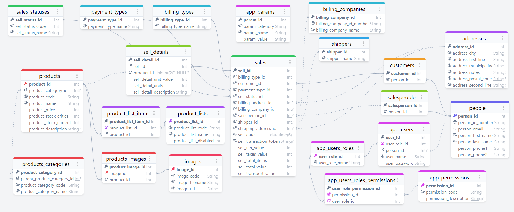

<h1 align="center">Streep eCommerce Spring Boot Backend</h1>

  A monolithic, [Spring Boot v2.6](https://docs.spring.io/spring-boot/docs/2.6.12/reference/html/)-based backend application for the eCommerce project Streep.

## Features 🚀

* Uses [Project Lombok](https://projectlombok.org)
  * You should have the correct plugin in your IDE to integrate with it.
  * Here's a list of [compatible software with their installation guides](https://projectlombok.org/setup/)  
* Exposes a [RESTful API](https://github.com/trebol-ecommerce/trebol-api)
  * Supports all operations as described by the document
  * Filtering, sorting and pagination of data are implemented through query params
  * Login, registration and guest accounts
  * Checking out with user or guest accounts
* Uses [Spring Data JPA](https://spring.io/projects/spring-data-jpa)
  * Annotated entity classes; including constraints and indexes where they are most needed at scale
    * Bundles drivers for H2 and MariaDB, but can virtually connect to any JDBC-compatible database with the correct driver
* Uses [Spring Security](https://spring.io/projects/spring-security)
  * Implements stateless session authentication/autorization through [JSON Web Tokens](https://jwt.io/) with aid from the [JJWT library](https://github.com/jwtk/jjwt)
    * Paired with `users`, `roles`, and `permissions` database tables (see `/src/main/resources/data.sql` for an example setup with 4 roles and users)
    * Do note that Authorities required in some controllers are hard-coded. These must match entries in the `permissions` table
  * Passwords are encoded using BCrypt
* Integrates payments with [Webpay Plus](https://transbankdevelopers.cl/producto/webpay) by Transbank ([Java SDK repo](https://github.com/TransbankDevelopers/transbank-sdk-java))
  * On due time, it may be possible to integrate more popular payment services such as Paypal and Stripe
* Integrates mail notifications with [Mailgun](https://mailgun.com) (an account and API key are required)
* Self-evident properties files for configuring mission-critical parameters such as
  * CORS mappings
  * JWT secret key and duration
  * BCrypt algorithm strength
  * Webpay integration endpoints
  * Mailgun & general mail properties

### Data model diagram

This schema was designed in a couple minutes using [Azimutt](https://github.com/azimuttapp/azimutt), a MIT-licensed, handy navigation and diagram visualization tool for Entity-Relationship models.

## Getting started 👍

### Requirements

* JDK 11+
* Apache Maven 3.6.0

### Installation

After cloning the repository, run `mvn verify`, grab a drink and wait a little. 
That command will:

- Download & install dependencies
- Compile the project
- Generate the WAR package file
- Install it to your local maven repo
- Run unit tests
- Check code coverage

**The important step here is to compile the project first**, because some classes (QueryDSL types such as `QUser`, `QProduct` and so on) are unversioned.

Instead, these classes are generated through a Maven plugin included within the project dependencies.

If for any reason you fail to compile, please run `mvn clean generate-sources` and try it again.

Also don't forget to install any [Project Lombok plugin for your IDE](https://projectlombok.org/setup/) if you don't have it already.

### How to use

You can quickly run the application over an embedded server by executing `mvn spring-boot:run`

Mailgun integration will only be available if the `mailgun` profile is active. Please read the `application-mailgun.empty.properties` file and [this bit of the Spring Boot documentation](https://docs.spring.io/spring-boot/docs/current/reference/html/features.html#features.profiles) to know how to proceed with that.

### Configuration

The default configuration profile, which is located at `/src/main/resources/application.properties`
contains sane default settings and brief summaries of what everything does.

You _can_ run the application out-of-the-box with these, though you should have a look at it.

Also remember, that Spring Boot does support using more than one profile at once.
[This](https://docs.spring.io/spring-boot/docs/2.6.12/reference/html/features.html#features.external-config) and 
[this](https://docs.spring.io/spring-boot/docs/2.6.12/reference/html/features.html#features.profiles) section of the Spring Boot guide can help you understand these mechanisms.

<!-- markdownlint-restore -->
<!-- prettier-ignore-end -->

<!-- ALL-CONTRIBUTORS-LIST:END -->

This project follows the [all-contributors](https://github.com/all-contributors/all-contributors) specification. Contributions of any kind welcome!
